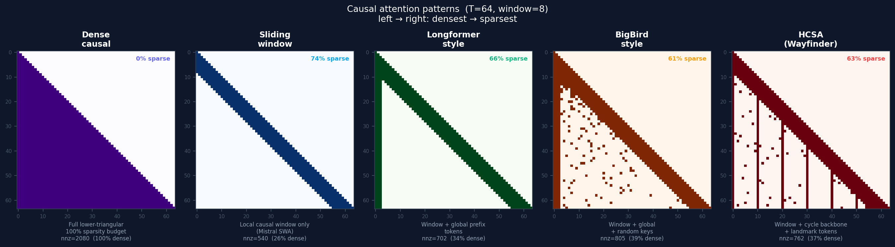

# Wayfinder

Sparse attention for long-context language models. Training-free — works on existing dense-attention models at inference time.

## How it works

In dense causal attention, every token attends to every earlier token — O(T^2) total edges. Wayfinder replaces this with a sparse graph where each token attends to a small neighborhood:

1. **Window** — the `w` most recent tokens (local context)
2. **Cycle shortcuts** — two tokens from a random token-visiting cycle
3. **Landmarks** — every `s`-th token (periodic anchors)

The cycle is the key idea. Take all T token positions and shuffle them into a random loop — a permutation where the last element connects back to the first. Each token gets two "shortcut" neighbors from this loop. Because the cycle visits every position exactly once, any token can reach any other through a chain of hops. Global information flow, without global attention.

Causal masking still applies — tokens only attend to earlier positions. Each token attends to at most `w + 2 + T/s` neighbors instead of all `T-1` predecessors.



## Results

Measured on Apple Silicon (M4 Max, 36 GB). Prefill tok/s — decode uses dense attention by default.

### Qwen 3.5 9B Q8 (llama.cpp, Apple Silicon)

| Context | Dense tok/s | Wayfinder tok/s | Delta |
|--------:|------------:|----------------:|------:|
| 4,096   | 7,038       | 7,038           | 0%    |
| 32,768  | 610         | 610             | 0%    |
| 65,536  | 517         | 631             | +22%  |

Qwen 3.5 is a hybrid model — 8 full-attention layers (`Qwen3_5Attention`, GQA) and 24 linear-attention layers (`Qwen3_5GatedDeltaNet`, [Gated DeltaNet](https://arxiv.org/abs/2412.06464)). Wayfinder only modifies the 8 full-attention layers (every 4th layer starting at index 3). The linear-attention layers use a completely different computation (linear recurrence with causal conv1d + gating) and are **not** targeted by the current swap path. End-to-end speedup is bounded by Amdahl's law.

### Qwen 3.5 9B (CUDA, Triton block-sparse, DGX Spark GB10)

Backbone prefill wall-clock, `block_sparse` path, `engine=triton`, `block_size=128`. Only the 8 full-attention layers are replaced. 8K–131K use BF16 weights (`warmup=1`, `repeats=3`). 262K uses FP8 weight-only quantization via `torchao` (`warmup=1`, `repeats=1`) — BF16 OOMs at this length.

| Context | Dense (ms) | Wayfinder (ms) | Speedup | Peak memory |
|--------:|-----------:|----------------:|--------:|------------:|
| 8,192   | 4,961      | 4,824           | 1.03x   | 18.4 GB     |
| 32,768  | 20,669     | 19,414          | 1.06x   | 23.5 GB     |
| 65,536  | 44,423     | 38,017          | 1.17x   | 30.2 GB     |
| 98,304  | 69,574     | 59,218          | 1.17x   | 37.0 GB     |
| 131,072 | 96,021     | 78,645          | 1.22x   | 43.8 GB     |
| 262,144 | 208,589    | 153,112         | **1.36x** | 64.4 GB   |

Wayfinder prefill throughput stays roughly flat as context grows while dense throughput degrades — the speedup increases with sequence length. Peak memory is matched because only 8 of 32 layers are swapped and the block topology overhead is near zero. At 262K, FP8 weight-only quantization (`--quantize fp8-weight-only`) reduces model memory from ~19 GB to ~11 GB, leaving ~100 GB free on the DGX Spark's 120 GB unified memory.

**Quality impact** (logit divergence, same model/input, dense vs Wayfinder):

| Context | Top-1 agreement | Relative L2 |
|--------:|----------------:|------------:|
| 4,096   | 99.88%          | 0.291       |
| 16,384  | 94.44%          | 0.340       |

At 4k context, Wayfinder predictions are nearly identical to dense. At 16k, ~5.6% of top-1 token predictions change. Quality degrades with context length — evaluate on your workload before deploying.

### Qwen 3.5 35B A3B FP8 (CUDA, Triton block-sparse, DGX Spark GB10)

Backbone prefill wall-clock on the text path (`forward_target=backbone`). The checkpoint is Qwen's native fine-grained FP8 release, so the working load path is `--quantize none` with BF16 compute; `dtype='auto'` fails on this stack before model load. Only the 10 `full_attention` layers are replaced. The 30 `linear_attention` / MoE layers stay stock.

| Context | Dense (ms) | Wayfinder (ms) | Speedup | Peak memory |
|--------:|-----------:|----------------:|--------:|------------:|
| 8,192   | 8,800      | 8,589           | 1.02x   | 35.7 GB     |
| 32,768  | 25,602     | 25,186          | 1.02x   | 40.5 GB     |
| 65,536  | 52,810     | 49,433          | 1.07x   | 46.9 GB     |
| 131,072 | 115,919    | 98,460          | 1.18x   | 59.7 GB     |

Wayfinder-only ceiling probes on the same setup:

| Context | Wayfinder (ms) | Wayfinder tok/s | Peak memory |
|--------:|----------------:|----------------:|------------:|
| 163,840 | 125,504         | 1,306           | 66.1 GB     |
| 196,608 | 144,106         | 1,364           | 72.5 GB     |
| 229,376 | 185,970         | 1,233           | 78.9 GB     |

The current CUDA path is verified safe through `229,376` tokens on GB10. `262,144` is not safely feasible right now: two separate Wayfinder attempts emitted only `experiment_meta` and drove live unified-memory usage to roughly `116.8-116.9 GiB`, leaving less than `0.4 GiB` host memory available before manual abort / process exit.

## Wayfinder Block Topology

The `block_sparse` path uses a staged communication-network attention pattern built from:

- causal local predecessor blocks
- deterministic long-range partner blocks (XOR, bit-reversal, or Benes schedule)
- fixed sink blocks

The stage changes by layer, so information propagates globally across O(log N) layers while each layer keeps a small, hardware-regular support.

Implementation details and the current CLI surface are documented in [docs/WAYFINDER_BLOCK_SPARSE.md](docs/WAYFINDER_BLOCK_SPARSE.md).

## Try it

```bash
git clone https://github.com/Hmbown/Wayfinder && cd Wayfinder
pip install -e ".[mlx]"

# Chat with Wayfinder-accelerated GLM-4.7-Flash (downloads automatically)
python3 scripts/chat_glm_wayfinder.py

# Dense baseline for comparison
python3 scripts/chat_glm_wayfinder.py --mode dense
```

## Limitations

- **Approximation.** Models were trained with dense attention. Wayfinder changes which tokens attend to which at inference time. Evaluate perplexity on your workload. Quality impact is under measurement but not yet validated at scale.
- **Prefill only.** Decode uses dense attention by default — at q_len=1, dense is already fast.
- **Graph construction on CPU.** At short context the overhead exceeds the savings, which is why the sparse gate only activates at longer sequences.
- **Hybrid models: only full-attention layers.** On Qwen 3.5, only the 8 `full_attention` layers are swapped. The 24 `linear_attention` (Gated DeltaNet) layers are a different computation entirely and are not targeted. Replacing DeltaNet layers would require a separate project.

## Related work

There are a few ways to deal with the quadratic cost of attention. Wayfinder is **training-free** — it works on existing dense-attention models at inference time, with no retraining. This makes it complementary to training-time methods rather than competing with them.

**Training-free (like Wayfinder):**
- **[FlexPrefill](https://arxiv.org/abs/2502.20766)** (ByteDance, ICLR 2025 Oral) — content-aware: estimates each head's attention distribution and allocates sparsity budgets per head per input.

**Requires training:**
- **[MoDA](https://arxiv.org/abs/2603.15619)** (ByteDance/HUST) — mixture-of-depths attention: each head attends to KV pairs from preceding layers (depth stream) in addition to the current sequence. Orthogonal to sequence-level sparsity — could be combined with Wayfinder.
- **[MSA](https://arxiv.org/)** — Memory Sparse Attention: scalable sparse attention with document-wise RoPE and memory interleaving for multi-hop reasoning across ultra-long context. Operates on a different axis (persistent memory) from Wayfinder (sequence sparsity).
- **[NSA/DSA](https://arxiv.org/abs/2502.11089)** (DeepSeek, GLM-5) — trained sparse attention with hardware-aligned kernels. Strong results, but requires training with the pattern.
- **[MoBA](https://arxiv.org/abs/2502.13189)** (Kimi) — learned block-level attention gating.

**Different computation:**
- **[MLA](https://arxiv.org/abs/2502.07864)** (DeepSeek, Kimi K2) — compresses the KV cache, reducing memory. Doesn't reduce compute.
- **[Gated DeltaNet](https://arxiv.org/abs/2412.06464)** (Qwen 3.5) — replaces softmax attention with linear recurrence. Different computation entirely.
- **[FlashAttention](https://arxiv.org/abs/2205.14135)** — exact dense attention with better memory access. Same work, faster kernels.

## Project structure

```
hcsa/
├── graph/abi.py          # Graph ABI: neigh_idx [T,D] int32, edge_type uint8
├── mlx/                  # MLX backend (fused dispatch, attention, model)
├── torch/                # PyTorch/CUDA backend
├── integrations/         # Model wrappers (GLM, Qwen, GPT-2)
├── topology/             # Graph construction
├── compiler/             # Graph spec compiler (.wf -> ABI)
└── cycles.py             # Cycle generation
```

Details: [docs/ARCHITECTURE.md](docs/ARCHITECTURE.md). Benchmark evidence: [docs/FIRST_RELEASE.md](docs/FIRST_RELEASE.md).

## License

MIT
