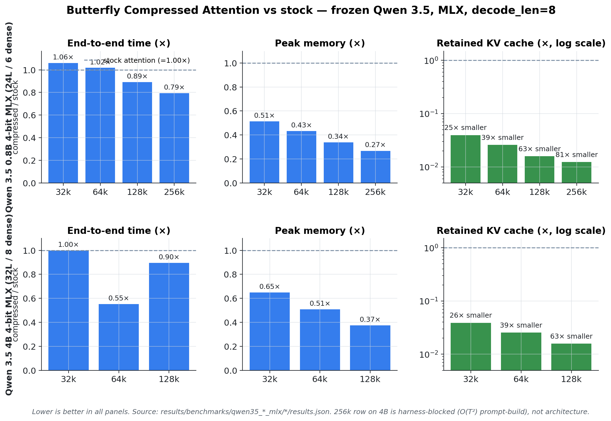
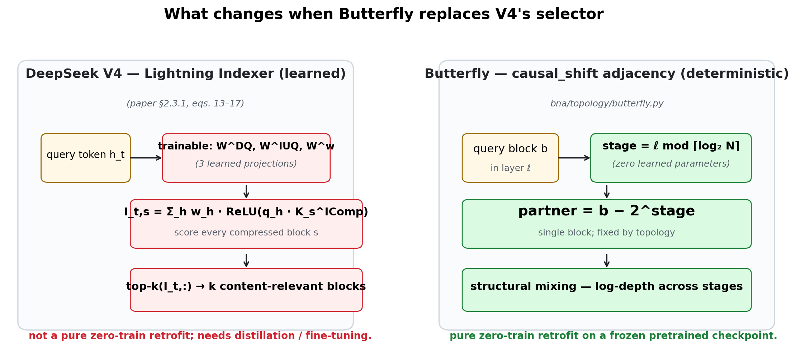
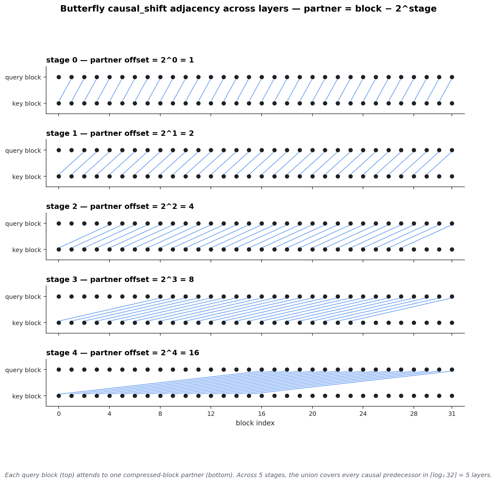
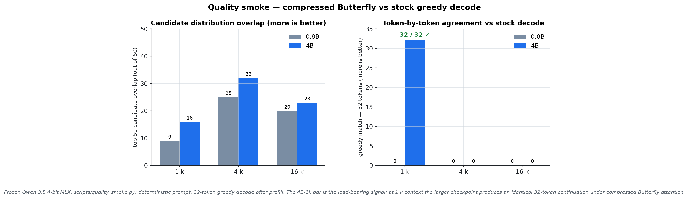
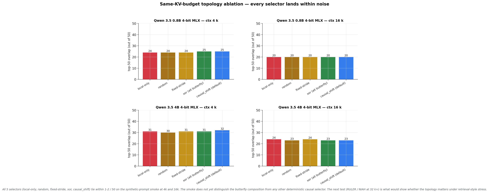

# Butterfly Compressed Attention

**Long-context inference, 81× less KV cache, no retraining.**

Drop-in sparse attention for *frozen* pretrained checkpoints. Swap the
full-attention layers, gain monotonically with context, never train a
thing. Validated on Apple Silicon (MLX) for Qwen 3.5 0.8B and 4B.

## Headline — Qwen 3.5 0.8B 4-bit MLX

| context | e2e ×    | peak ×   | retained KV × |
|--------:|---------:|---------:|--------------:|
| 32 k    | 1.06     | **0.51** | **0.040**     |
| 64 k    | 1.02     | **0.43** | **0.026**     |
| 128 k   | **0.89** | **0.34** | **0.016**     |
| 256 k   | **0.79** | **0.27** | **0.012**     |

Lower is better in every column. By 256 k: **21 % faster, 27 % of stock peak,
81 × smaller retained KV.** Replicates on the 4B checkpoint with the same
trend.



→ Full positioning, V4 vs Butterfly, replication, claim boundary:
**[`docs/BUTTERFLY_POSITIONING.md`](docs/BUTTERFLY_POSITIONING.md)**.

---

## The one-line idea

V4-style compressed attention picks blocks with a *learned, content-relevant*
top-k indexer. **Butterfly picks them with a *deterministic, structure-relevant*
graph: `partner = block − 2^stage`.** Zero learned parameters → pure
zero-train retrofit on a frozen checkpoint.

(The same-KV ablation below is honest about which parts of this story are
already evidenced — the architecture as a whole, and not yet the topology
choice specifically.)



## Topology



Each layer ℓ uses one stage; `stage = ℓ mod ⌈log₂ N⌉`. Direct edges hit
power-of-two causal offsets only (b−1, b−2, b−4, …); arbitrary earlier
blocks **reach** later ones through composition over ⌈log₂ N⌉ stages, since
each stage's compressed states already carry the previous stage's mixed
context forward. Reachability through recursive mixing — not direct
full-prefix coverage.

## Quality smoke



**4B at 1 k context: greedy decode is 32/32 identical to stock**, top-1
agrees. At 4 k / 16 k the candidate distributions overlap (top-50 32 / 50,
23 / 50), but greedy decode diverges — expected for sparse routing without
indexer retraining, not breakage. RULER / NIAH is the next evidence step.

## Topology ablation — *honest null result*



We ran the same-KV-budget ablation that the topology claim deserves
(`local-only` vs `random` vs `fixed-stride` vs `xor` vs `causal_shift`,
identical compressor and SWA window, on both 0.8B and 4B at 4 k and 16 k).
**Every variant lands within 1–2 / 50 of the others.** The smoke does
*not* yet distinguish the butterfly composition from any other
deterministic causal selector — including dropping the compressed-block
stream entirely. So today's defensible claim is:

> **Compressed Butterfly retrofits onto frozen Qwen 3.5 4-bit checkpoints
> and recovers smoke-level quality at 27 % peak / 81 × less retained KV.
> The architecture (SWA + mean-pool compressor + one deterministic
> partner per layer) is the load-bearing piece. The choice of *which*
> partner does not yet differentiate.**

Whether `causal_shift` specifically matters at long context with retrieval
stress is the next experimental question; the smoke can't tell.
[BUTTERFLY_POSITIONING §D.3](docs/BUTTERFLY_POSITIONING.md#d3-same-kv-budget-topology-ablation--null-result)
has the full table.

## Replicate in one shell

```bash
VENV=/path/to/.venv-macos-metal/bin/python
HF_CACHE=/path/to/hf_cache
QWEN08B=$HF_CACHE/hub/models--mlx-community--Qwen3.5-0.8B-4bit/snapshots/<HASH>

# Compressed Butterfly at 64 k — single repeat, decode_len=8.
$VENV scripts/bench_qwen_consumer_mlx.py --model-path "$QWEN08B" \
  --hf-home "$HF_CACHE" --hf-hub-cache "$HF_CACHE/hub" --hf-offline \
  --mode compressed_butterfly --block-partner-rule causal_shift \
  --compressed-local-window-tokens 64 --query-chunk-size 64 --block-size 128 \
  --butterfly-decode-backend stock \
  --seq-lens 65536 --decode-len 8 --repeats 1 --chunk-size 384 --kv-step 384 \
  --skip-multi-turn --skip-quality --stage-timeout-sec 1200 \
  --out-dir results/qwen08b/comp_64k
```

Pull numbers out:

```python
import json
d = json.load(open("results/qwen08b/comp_64k/results.json"))["single_turn"][0]
print(d["e2e_sec"],
      d["peak_memory_bytes"] / (1024**3),                  # GB
      d["cache_storage_after_prefill"]["total_bytes"]/1e6) # MB retained KV
```

Full ladder + 4B + quality recipe: see
[`BUTTERFLY_POSITIONING §G`](docs/BUTTERFLY_POSITIONING.md#g-replicating-these-numbers).

## Repo map

```
bna/topology/butterfly.py        causal_shift partner rule
bna/mlx/attention.py             multi-stream SWA + compressed merge
bna/mlx/compressed_cache.py      two-pool fixed-buffer KV cache
bna/integrations/qwen_mlx.py     layer swap + graph-cache eviction
scripts/bench_qwen_consumer_mlx.py    every number in the doc
scripts/quality_smoke.py              top-50 / KL / greedy parity
scripts/render_butterfly_assets.py    regenerates the 4 PNGs from JSON
docs/BUTTERFLY_POSITIONING.md         start here
docs/COMPRESSED_BUTTERFLY_ATTENTION.md  variant claim boundary
docs/ARCHITECTURE.md                  contributor-facing map
docs/APPLE_SILICON_SETUP.md           MLX venv + model catalog
docs/BUTTERFLY_THEOREMS.md            paper-side proof status
results/benchmarks/qwen35_0p8b_mlx/   raw JSON + OVERNIGHT_LOG.md
results/benchmarks/qwen35_4b_mlx/     4B replication artifacts
results/quality/qwen35_4b/            4B quality-smoke JSON
```

## Next tests

1. **NIAH / RULER at 32 k–128 k.** Turn smoke into evidence.
2. **`stock` vs `local-only` vs `random partner` vs `fixed stride` vs
   `causal_shift` at the same KV budget.** Proves the topology is doing
   real work, not "any KV trim helps".
3. **CUDA validation on a 10 GB RTX 3080.** Memory wins are architectural —
   they should transfer; speed wins partly aren't.
4. **Qwen 3.6 27B 4-bit on a 36 GB Mac.** Where 63 ×–81 × KV reduction
   determines whether the model fits at all.
5. **Streamed prompt-build** in the bench harness — unblocks 256 k + on 4B.
6. **Learned compressor / counter-RoPE / decode-mode kernel** — close the
   remaining V4-vs-Butterfly gaps without breaking the no-train property.

## Related work

DeepSeek V4 ([hf](https://huggingface.co/deepseek-ai/DeepSeek-V4-Pro)) ·
[BigBird](https://arxiv.org/abs/2007.14062) ·
[Longformer](https://arxiv.org/abs/2004.05150) ·
[Monarch](https://arxiv.org/abs/2204.00595) ·
[FlexPrefill](https://arxiv.org/abs/2502.20766) ·
[NSA](https://arxiv.org/abs/2502.11089) ·
[MoBA](https://arxiv.org/abs/2502.13189)

## License

MIT
