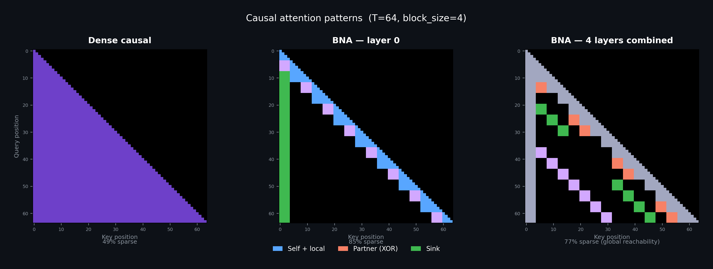

# BNA — Butterfly Network Attention

Training-free block-sparse attention for long-context inference. Works on existing dense-attention models without retraining.



## How it works

In dense attention, every token attends to every earlier token — O(T²) work per layer. As context gets longer, throughput drops.

BNA splits the sequence into fixed-size blocks (128 tokens) and restricts which blocks can attend to each other. Each block sees:

- **Itself and its immediate neighbors** (local context)
- **One long-range partner block** chosen by a [butterfly network](https://en.wikipedia.org/wiki/Butterfly_network) schedule — at layer `l`, block `b` partners with block `b XOR (1 << (l mod log₂ N))`
- **Block 0** (handles the [attention sink](https://arxiv.org/abs/2309.17453) effect)

The partner changes every layer. After log₂(N) layers, every block can transitively reach every other block. Per-layer work is O(T) instead of O(T²).

## Results

### Qwen 3.5 9B — DGX Spark GB10

Triton block-sparse kernel, `block_size=128`. 8 of 32 layers replaced (24 [DeltaNet](https://arxiv.org/abs/2412.06464) layers untouched). BF16 through 131K, FP8 weight-only at 262K.

| Context | Dense tok/s | BNA tok/s | Top-1 agreement |
|--------:|------------:|----------:|----------------:|
| 4,096   | —           | —         | 99.88%          |
| 8,192   | 1,651       | 1,698     | —               |
| 16,384  | —           | —         | 94.44%          |
| 32,768  | 1,585       | 1,688     | —               |
| 65,536  | 1,475       | 1,724     | —               |
| 98,304  | 1,413       | 1,660     | —               |
| 131,072 | 1,365       | 1,667     | —               |
| 262,144 | 1,257       | 1,712     | —               |

Dense throughput drops 24% from 8K to 262K. BNA stays flat around 1,700 tok/s. At 262K that's 1.36x faster. Memory usage is the same.

### Qwen 3.5 35B A3B FP8

10 of 40 layers replaced. 30 linear-attention / MoE layers untouched.

| Context | Dense tok/s | BNA tok/s |
|--------:|------------:|----------:|
| 8,192   | 931         | 954       |
| 32,768  | 1,280       | 1,301     |
| 65,536  | 1,241       | 1,326     |
| 131,072 | 1,131       | 1,331     |
| 163,840 | —           | 1,306     |
| 196,608 | —           | 1,364     |
| 229,376 | —           | 1,233     |

### Output quality

BNA is an approximation. "Top-1 agreement" is the percentage of positions where BNA and dense attention predict the same next token. At 4K tokens it's 99.88% — nearly identical. At 16K it's 94.44%.

Perplexity and downstream task evaluations haven't been done yet.

### Qwen 3.5 9B — Mac Studio M4 Max (36 GB)

MLX permute-window path with K6 fused Metal kernel, `window=64`. 8 of 32 attention layers replaced. 4-bit quantized model (`mlx-community/Qwen3.5-9B-MLX-4bit`).

| Context | Dense TTFT | BNA TTFT | Dense tok/s | BNA tok/s | Peak memory |
|--------:|-----------:|---------:|------------:|----------:|------------:|
| 2,048   | 71 ms      | 49 ms    | 62.2        | 62.0      | 7.1 GB      |
| 8,192   | 116 ms     | 86 ms    | 57.2        | 58.8      | 9.9 GB      |
| 32,768  | 447 ms     | 416 ms   | 48.0        | 48.1      | 13.7 GB     |
| 65,536  | 160 ms     | 650 ms   | 41.5        | 31.2      | 18.9 GB     |
| 98,304  | 2.0 s      | 3.7 s    | 17.2        | 11.9      | 24.0 GB     |
| 131,072 | 6.9 s      | 9.9 s    | 7.3         | 5.4       | 29.1 GB     |
| 163,840 | 26.8 s     | —        | 2.2         | —         | 34.2 GB     |

BNA wins at short-to-mid context (2K–32K) where the K6 Metal kernel eliminates permutation overhead. At 65K+ the MLX permute-window prefill path is slower than dense — the Python-level `take_along_axis` and mask construction dominates. This is an MLX-specific limitation; the CUDA Triton block-sparse kernel does not have this issue (see DGX results above).

Top-1 agreement: 100% (5/6 quality tasks identical to dense). Max context on 36 GB: 163K tokens (dense), 131K tokens (BNA).

## Try it

### CUDA (NVIDIA GPU)

```bash
git clone https://github.com/Hmbown/Butterfly && cd Butterfly
pip install -e ".[dev,kernels]"

python scripts/bench_qwen35_cuda_wayfinder.py \
    --model-path <path-to-Qwen3.5-9B> \
    --path block_sparse --engine triton --block-size 128 \
    --seq-lens 4096 8192 16384 32768
```

### MLX (Apple Silicon)

```bash
git clone https://github.com/Hmbown/Butterfly && cd Butterfly
pip install -e ".[mlx]"
pip install mlx-lm zmlx   # model loading + Metal kernel runtime

# Environment check
python scripts/env_check_mlx.py

# Benchmark (downloads model automatically)
python scripts/bench_qwen_consumer_mlx.py \
    --model-path mlx-community/Qwen3.5-9B-MLX-4bit \
    --mode wayfinder \
    --seq-lens 2048 8192 32768 \
    --decode-len 256 --repeats 3 \
    --out-dir results/benchmarks/my_run
```

Set `HF_HOME` to an SSD path for faster model loading (the script defaults to `/Volumes/VIXinSSD/hf_cache` if it exists).

The `--mode dense` flag runs the stock attention baseline for comparison. Add `--skip-quality` to benchmark only throughput.

## Related work

BNA is training-free — it works on existing models at inference time.

- [BigBird](https://arxiv.org/abs/2007.14062) — random + window + global tokens; BNA replaces the random blocks with a deterministic butterfly schedule
- [Longformer](https://arxiv.org/abs/2004.05150) — sliding window + global attention
- [Monarch](https://arxiv.org/abs/2204.00595) — butterfly matrices for structured computation
- [FlexPrefill](https://arxiv.org/abs/2502.20766) — content-aware per-head sparsity budgets
- [NSA](https://arxiv.org/abs/2502.11089) / [MoBA](https://arxiv.org/abs/2502.13189) — trained sparse attention

## License

MIT
