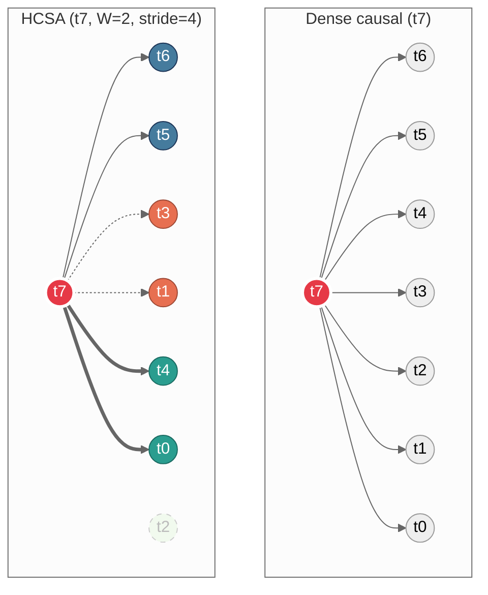

# Wayfinder (HCSA)

**Hamiltonian Cycle Sparse Attention (HCSA)**: sparse causal attention where each token attends to an explicit **graph neighborhood** (Hamiltonian-cycle backbone + local causal window + optional landmarks). A full Hamiltonian cycle is constructed over all T positions; causal masking (`j < i`) then restricts each token to the subset of its cycle neighbors that precede it, so the effective per-layer structure is a directed subgraph of the cycle. Core representation is a backend-agnostic **Graph ABI** (application binary interface — a systems-level contract, not a graph-theoretic term); backends include **PyTorch** and **MLX**.

**Graph ABI** (`hcsa/graph/abi.py`):
- `neigh_idx`: padded `int32` neighbor indices (`-1` = PAD), shape `[T,D]` or `[H,T,D]`
- `edge_type`: `uint8` edge labels (`PAD/CYCLE/WINDOW/LANDMARK/REWIRE`)

## Token interactions: dense vs HCSA

Both panels show which tokens **t7** attends to in a single layer.



**HCSA edge types** (self-attention always included, omitted from diagram):

| Node color | Arrow | Type | Rule |
|---|---|---|---|
| red | — | query | the token computing attention |
| blue | solid `-->` | window | W nearest causal neighbors |
| orange | dashed `-.->` | cycle | Hamiltonian-cycle neighbor(s) with j < i |
| green | thick `==>` | landmark | every stride-th position with j < i |
| gray dashed | — | *not reached* | outside neighborhood this layer |

Dense: fan-in = **T - 1** per token, **O(T^2)** total edges, **O(T^2 d)** attention cost.
HCSA: fan-in = **W + 2 + T/s** per token (degree D), **O(T D)** total edges, **O(T D d)** attention cost.
The +2 = cycle predecessor + cycle successor (undirected edges from the Hamiltonian cycle; after causal masking on average ~1 survives per token). Self-attention is always included but not counted in D.
At T = 4096, W = 64, stride = 64: D = 130 vs 4095 — a **31x** reduction in edges per token.

## Benchmarks

All numbers on Apple M-series silicon, MLX backend, 4-bit quantized weights. W=64, chunk=4096, circular windowing.

### Qwen3-1.7B-4bit — isolated attention (single layer, no MLP)

Just the attention kernel: Q/K/V multiply-and-reduce, one layer. Shows the raw O(TD) vs O(T^2) scaling — HCSA touches a fixed-size neighborhood per token regardless of sequence length.

| T | Dense tok/s | HCSA tok/s | Speedup |
|------:|----------:|----------:|--------:|
| 8192 | 174,964 | 227,455 | **1.30x** |
| 16384 | 112,437 | 236,100 | **2.10x** |
| 32768 | 62,733 | 236,420 | **3.77x** |

HCSA throughput stays flat (~230K tok/s) while dense degrades quadratically.

### Qwen3-1.7B-4bit — full transformer block (attention + MLP + norms)

One complete block. MLP and norms are O(T) and don't benefit from sparse attention, so they dilute the speedup vs the isolated kernel above.

| T | Dense tok/s | HCSA tok/s | Speedup | Memory reduction |
|------:|----------:|----------:|--------:|--------:|
| 8192 | 75,857 | 82,949 | 1.09x | 15.2% |
| 16384 | 60,916 | 84,444 | 1.39x | 15.6% |
| 32768 | 42,847 | 85,466 | **2.00x** | 10.1% |

### GLM-4.7-Flash-4bit — full model (47 layers, MoE)

End-to-end chunked prefill through all 47 layers of a production MoE model (9B total, ~4B active). Attention is now a small fraction of total compute — MoE FFN, MLA projections, and norms dominate. Graph construction adds one-time Python-side overhead per sequence length.

| T | Dense tok/s | HCSA tok/s | Dense memory | HCSA memory | Memory reduction |
|------:|----------:|----------:|--------:|--------:|--------:|
| 8192 | 254 | 121 | 19.2 GB | 20.0 GB | — |
| 16384 | 360 | 175 | 20.9 GB | 20.4 GB | 2.4% |
| 32768 | 177 | 148 | 24.2 GB | 20.8 GB | **22.9%** |

HCSA is slower end-to-end at these lengths because the attention savings are diluted by non-attention layers. But memory scales sub-linearly (dense per-chunk latency grows from 6.5s to 38.9s at 32K; HCSA stays flat at ~30-33s), and the 23% memory reduction at 32K is real.

Raw data: [`benchmarks/`](benchmarks/)

## Install

```bash
git clone <this-repo> && cd <this-repo>
pip install -e ".[dev]"

# Optional
pip install -e ".[mlx]"   # Apple Silicon backend
pip install -e ".[viz]"   # matplotlib/networkx diagnostics
```

## Run the tests

```bash
pytest
```

## Run something small

Tiny train (PyTorch core):

```bash
python -m hcsa.train --data data/tinyshakespeare.txt --tokenizer char \
  --attn hcsa --cycle random --window 32 --landmark-stride 32 --steps 200
```

MLX scaling benchmark:

```bash
python scripts/bench_mlx_wayfinder_scale.py \
  --seq-lens 256 512 1024 2048 4096 \
  --batch 2 --heads 4 --embd 128 \
  --window 32 --landmark-stride 32
```

## What the attention graph looks like

Dense attention (left) vs HCSA connectivity (right) at T=64, W=8, stride=16:


HCSA graph on 32 tokens (circle layout — blue = cycle, green = window, red = landmark; only causal edges shown):


## Where to look (research map)

| Path | Purpose |
|---|---|
| `hcsa/attention_hcsa.py`, `hcsa/model.py` | Core sparse attention + reference GPT |
| `hcsa/cycles.py`, `hcsa/graph_strategies.py` | Cycle construction + strategy wrappers |
| `hcsa/graph/abi.py` | Graph ABI (neighbor indices + edge typing) |
| `hcsa/graph/analysis.py` | Empirical diagnostics: spectral gap, random-walk mixing, edge-drop resilience, cluster regularity, coverage |
| `hcsa/topology/core.py` | Topology runtime (construct/save/load/rewire) |
| `hcsa/compiler/` + `configs/graph_specs/*.wf` | Graph-spec compiler + cache artifacts |
| `hcsa/mlx/`, `hcsa/torch/` | Backend implementations |
| `scripts/wayc.py` | CLI: compile/validate/bench + discovery setup |
| `tests/` | Correctness + diagnostics coverage |
| `benchmarks/` | Experiment results + benchmark data |

## References

**Sparse & structured attention**
- The Sparse Frontier — sparse attention trade-offs in Transformer LLMs: https://arxiv.org/abs/2504.17768
- Native Sparse Attention (NSA) — hardware-aligned trainable sparse attention: https://arxiv.org/abs/2502.11089
- Mixture of Sparse Attention (MoSA) — expert-choice dynamic sparse routing: https://arxiv.org/abs/2505.00315
- PBS-Attn — token permutation for block-sparse prefill: https://arxiv.org/abs/2510.21270
- DHSA — dynamic hierarchical sparse attention for on-device LLMs: https://arxiv.org/abs/2510.24606
- SPLA — block sparse plus linear attention hybrid: https://arxiv.org/abs/2601.22379
- Differential Transformer — attention as difference of two softmax maps: https://arxiv.org/abs/2410.05258
- BigBird — local + random + global sparse attention (universal approximation, Turing completeness): https://arxiv.org/abs/2007.14062
- Exphormer — expander-graph sparse attention for graph transformers: https://arxiv.org/abs/2303.06147

**Efficient kernels & programming models**
- FlashInfer — block-sparse KV-cache engine for LLM inference: https://arxiv.org/abs/2501.01005
- Flex Attention — compiler-driven custom attention kernels: https://arxiv.org/abs/2412.05496

**Hybrid attention-SSM**
- Mamba-2 / Structured State Space Duality: https://arxiv.org/abs/2405.21060
- Hymba — hybrid attention + Mamba heads: https://arxiv.org/abs/2411.13676

**Graph theory**
- Hamiltonicity of expanders — optimal bounds (Krivelevich-Sudakov conjecture): https://arxiv.org/abs/2402.06603
- TTT-Discover (test-time tuning/training): https://arxiv.org/abs/2601.16175

## License

MIT. See [`LICENSE`](LICENSE).
