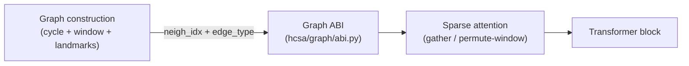
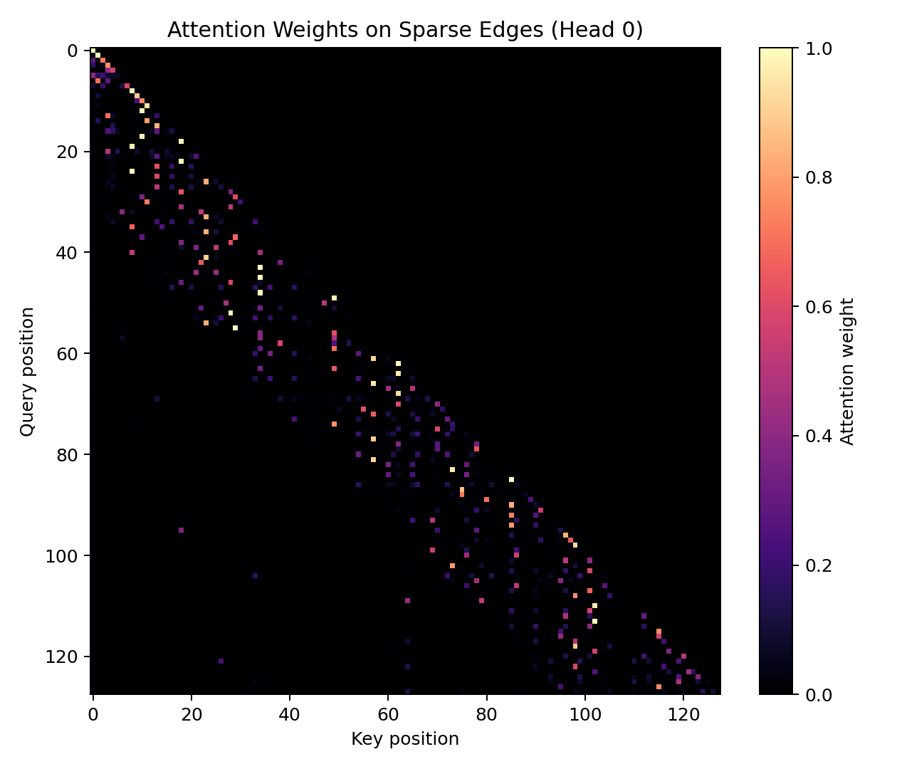
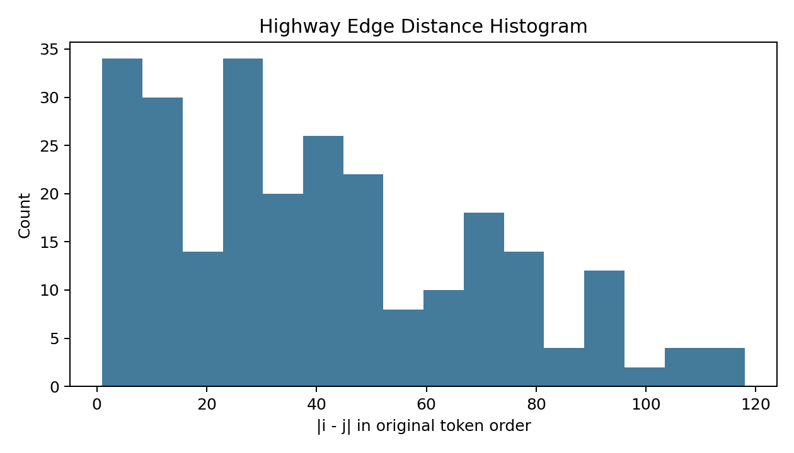

# Wayfinder (HCSA)

**Hamiltonian Cycle Sparse Attention (HCSA)**: sparse causal attention where each token attends to an explicit **graph neighborhood** (Hamiltonian-cycle backbone + local causal window + optional landmarks). Core representation is a backend-agnostic **Graph ABI**; backends include **PyTorch** and **MLX**.

**Graph ABI** (`hcsa/graph/abi.py`):
- `neigh_idx`: padded `int32` neighbor indices (`-1` = PAD), shape `[T,D]` or `[H,T,D]`
- `edge_type`: `uint8` edge labels (`PAD/CYCLE/WINDOW/LANDMARK/REWIRE`)

## Overview: graph → attention



If you're coming from graph theory: the research question is how **different constant-degree (or low-degree) token graphs** affect reachability/mixing *in practice* (see `hcsa/graph/analysis.py`). Kernel discovery is performance plumbing around the same graph/ABI.

## Install

```bash
git clone <this-repo> && cd <this-repo>
pip install -e ".[dev]"

# Optional
pip install -e ".[mlx]"   # Apple Silicon backend
pip install -e ".[viz]"   # matplotlib/networkx diagnostics
```

## Run the tests

```bash
pytest
```

## Run something small

Tiny train (PyTorch core):

```bash
python -m hcsa.train --data data/tinyshakespeare.txt --tokenizer char \
  --attn hcsa --cycle random --window 32 --landmark-stride 32 --steps 200
```

MLX scaling benchmark:

```bash
python scripts/bench_mlx_wayfinder_scale.py \
  --seq-lens 256 512 1024 2048 4096 \
  --batch 2 --heads 4 --embd 128 \
  --window 32 --landmark-stride 32
```

## Graph properties → attention patterns





## Where to look (research map)

| Path | Purpose |
|---|---|
| `hcsa/attention_hcsa.py`, `hcsa/model.py` | Core sparse attention + reference GPT |
| `hcsa/cycles.py`, `hcsa/graph_strategies.py` | Cycle construction + strategy wrappers |
| `hcsa/graph/abi.py` | Graph ABI (neighbor indices + edge typing) |
| `hcsa/graph/analysis.py` | Spectral gap / mixing proxy / resilience / regularity / coverage |
| `hcsa/topology/core.py` | Topology runtime (construct/save/load/rewire) |
| `hcsa/compiler/` + `configs/graph_specs/*.wf` | Graph-spec compiler + cache artifacts |
| `hcsa/mlx/`, `hcsa/torch/` | Backend implementations |
| `scripts/wayc.py` | CLI: compile/validate/bench + discovery setup |
| `tests/` | Correctness + diagnostics coverage |
| `benchmarks/`, `notes/LAB_NOTEBOOK.md` | Experiments + results |

## Kernel auto-find (optional; setup here)

This repo provides **discovery target specs + setup scaffolding** (no model load / no inference). Kernel search/export uses `zmlx.discover` from **ZMLX**: https://github.com/Hmbown/ZMLX.

```bash
# List discovery targets (K1–K5)
python scripts/wayc.py discover-targets --targets all

# Generate session stubs + seed kernels (setup-only)
python scripts/wayc.py discover-setup \
  --targets all \
  --zmlx-root /path/to/ZMLX \
  --sessions-root discover_sessions \
  --kernel-out-root hcsa/mlx/kernels/metal \
  --strict
```

See: `docs/discover_setup.md`, `hcsa/discover/targets.py`, `hcsa/discover/session.py`.

## References

- Hamilton cycles in pseudorandom graphs (resilience/decompositions): https://arxiv.org/abs/2507.22807
- Exphormer (Sparse Transformers for Graphs): https://arxiv.org/abs/2303.06147
- TTT-Discover (test-time tuning/training): https://arxiv.org/abs/2601.16175
- ZMLX (`zmlx.discover`): https://github.com/Hmbown/ZMLX

## License

MIT. See [`LICENSE`](LICENSE).
