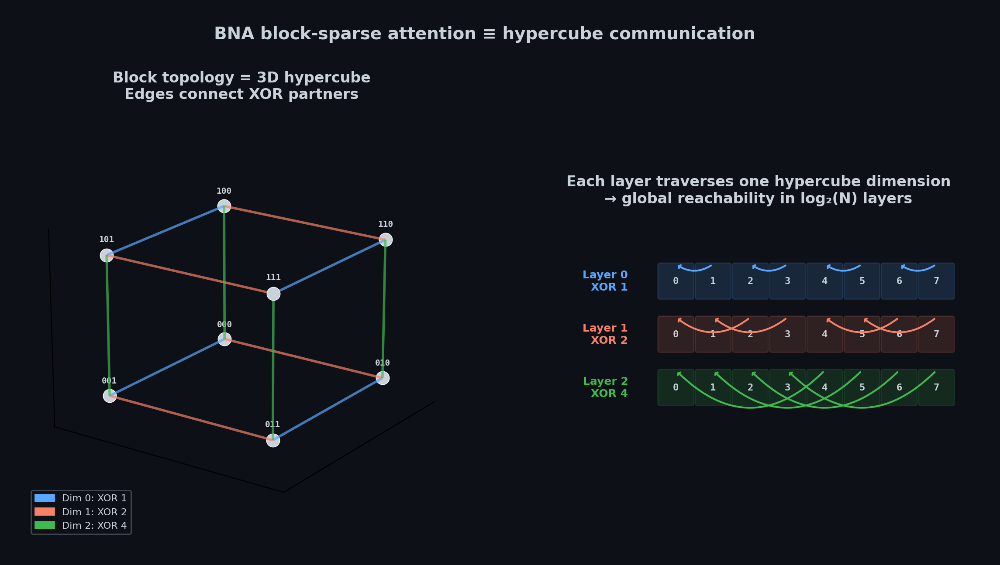

# BNA — Butterfly Network Attention

Training-free block-sparse attention for long-context inference. Drop-in replacement for dense attention — maintains throughput as context grows from 8K to 262K tokens.


## The idea

Dense attention is O(T²) — throughput degrades as context gets longer. BNA replaces it with a static block-sparse pattern that keeps each block's attention neighborhood small and fixed, regardless of sequence length.

Each block attends to **itself + local neighbors**, a **butterfly network partner** (`b XOR (1 << layer)`), and a **sink block**. The partner rotates across layers so that after log₂(N) layers, every block can reach every other — the same topology as a [hypercube](https://en.wikipedia.org/wiki/Hypercube) / [butterfly network](https://en.wikipedia.org/wiki/Butterfly_network).



No graph construction, no learned routing, no irregular memory access. The topology is computed by bit arithmetic in microseconds. Each block runs a regular dense matmul, mapping directly to Triton/CUDA block operations.

## Results

### Qwen 3.5 9B — DGX Spark GB10

Triton block-sparse, `block_size=128`. 8 of 32 layers replaced (24 [DeltaNet](https://arxiv.org/abs/2412.06464) layers stay stock). BF16 through 131K, FP8 weight-only at 262K.

| Context | Dense tok/s | BNA tok/s | Top-1 agreement |
|--------:|------------:|----------:|----------------:|
| 4,096   | —           | —         | 99.88%          |
| 8,192   | 1,651       | 1,698     | —               |
| 16,384  | —           | —         | 94.44%          |
| 32,768  | 1,585       | 1,688     | —               |
| 65,536  | 1,475       | 1,724     | —               |
| 98,304  | 1,413       | 1,660     | —               |
| 131,072 | 1,365       | 1,667     | —               |
| 262,144 | 1,257       | 1,712     | —               |

Dense throughput drops from 1,651 to 1,257 tok/s (24% degradation). BNA stays flat around 1,700 tok/s across the entire range. At 262K, that's a **1.36x** speedup. Memory is matched — block topology overhead is near zero.

### Qwen 3.5 35B A3B FP8

10 of 40 layers replaced (30 linear-attention / MoE layers stock).

| Context | Dense tok/s | BNA tok/s |
|--------:|------------:|----------:|
| 8,192   | 931         | 954       |
| 32,768  | 1,280       | 1,301     |
| 65,536  | 1,241       | 1,326     |
| 131,072 | 1,131       | 1,331     |
| 163,840 | —           | 1,306     |
| 196,608 | —           | 1,364     |
| 229,376 | —           | 1,233     |

### Quality

BNA is an approximation — it changes which tokens attend to which. Top-1 agreement (% of positions where BNA and dense predict the same next token) is **99.88% at 4K** and **94.44% at 16K** on Qwen 3.5 9B.

Perplexity and downstream task accuracy have not been evaluated yet. Evaluate on your workload before deploying.

## Try it

```bash
git clone https://github.com/Hmbown/Butterfly && cd Butterfly
pip install -e ".[dev]"

python scripts/bench_qwen35_cuda_wayfinder.py \
    --model-path <path-to-Qwen3.5-9B> \
    --path block_sparse --engine triton --block-size 128 \
    --seq-lens 4096 8192 16384 32768
```

## Related work

BNA is **training-free** — works on existing models at inference time.

- [BigBird](https://arxiv.org/abs/2007.14062) — random + window + global; BNA replaces random blocks with a deterministic butterfly schedule
- [Longformer](https://arxiv.org/abs/2004.05150) — sliding window + global attention
- [Monarch](https://arxiv.org/abs/2204.00595) — butterfly matrices for structured computation
- [FlexPrefill](https://arxiv.org/abs/2502.20766) — content-aware per-head sparsity budgets
- [NSA](https://arxiv.org/abs/2502.11089) / [MoBA](https://arxiv.org/abs/2502.13189) — trained sparse attention (not training-free)

## License

MIT
