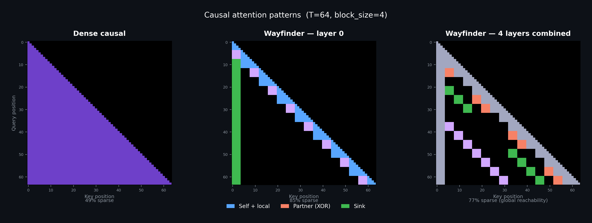

# Wayfinder

Block-structured attention acceleration for long-context inference. Training-free — works on existing dense-attention models at inference time.

## How it works

Dense attention is O(T²) per layer — every token scores against every earlier token. Wayfinder replaces this with a block-sparse pattern where each block only attends to a small, fixed set of other blocks, reducing per-layer work to O(T·B) where B is constant. Linear instead of quadratic — the speedup grows with sequence length.



### Block topology

The sequence is split into fixed-size blocks (typically 128 tokens). Each block attends to:

1. **Self + local predecessors** — the block itself and its immediate neighbors
2. **Partner blocks** — deterministic long-range blocks from a staged schedule
3. **Sink blocks** — early-sequence anchors (handles the [attention sink](https://arxiv.org/abs/2309.17453) effect)

### Global mixing via butterfly networks

The partner schedule is borrowed from [butterfly](https://en.wikipedia.org/wiki/Butterfly_network) and [Benes](https://en.wikipedia.org/wiki/Clos_network#Bene%C5%A1_network_(m_=_n_=_2)) networks — the same topology used in telecom switch fabrics and parallel computing interconnects since the 1960s.

At stage `s`, each node `b` connects to node `b XOR (1 << s)` — flipping one bit of the address per stage. After log₂(N) stages, any node can reach any other. Wayfinder maps this to transformer layers: at layer `l`, block `b` partners with block `b XOR (1 << (l mod log₂ N))`.

No single layer has global attention, but the **stack** of layers provides global reachability in O(log N) hops.

### Hardware alignment

The block layout is static and compile-time known — no routing, no learned gating, no irregular memory access. Each block runs a regular dense matmul against a small contiguous K/V set, mapping directly to Triton/CUDA block operations.

## Results

### Qwen 3.5 9B — CUDA, Triton block-sparse, DGX Spark GB10

`block_sparse` path, `engine=triton`, `block_size=128`. Only the 8 full-attention layers are replaced (24 [Gated DeltaNet](https://arxiv.org/abs/2412.06464) layers stay stock). 8K–131K: BF16. 262K: FP8 weight-only via `torchao` (BF16 OOMs).

| Context | Dense (ms) | Wayfinder (ms) | Speedup | Peak mem |
|--------:|-----------:|----------------:|--------:|---------:|
| 8,192   | 4,961      | 4,824           | 1.03x   | 18.4 GB  |
| 32,768  | 20,669     | 19,414          | 1.06x   | 23.5 GB  |
| 65,536  | 44,423     | 38,017          | 1.17x   | 30.2 GB  |
| 98,304  | 69,574     | 59,218          | 1.17x   | 37.0 GB  |
| 131,072 | 96,021     | 78,645          | 1.22x   | 43.8 GB  |
| 262,144 | 208,589    | 153,112         | **1.36x** | 64.4 GB |

Speedup increases with context because dense grows quadratically while Wayfinder grows linearly. Memory is matched — block topology overhead is near zero.

### Qwen 3.5 35B A3B FP8 — same hardware

10 `full_attention` layers replaced. 30 `linear_attention` / MoE layers stock. Native FP8 checkpoint, BF16 compute.

| Context | Dense (ms) | Wayfinder (ms) | Speedup | Peak mem |
|--------:|-----------:|----------------:|--------:|---------:|
| 8,192   | 8,800      | 8,589           | 1.02x   | 35.7 GB  |
| 32,768  | 25,602     | 25,186          | 1.02x   | 40.5 GB  |
| 65,536  | 52,810     | 49,433          | 1.07x   | 46.9 GB  |
| 131,072 | 115,919    | 98,460          | 1.18x   | 59.7 GB  |

Wayfinder-only probes (no dense layers, testing ceiling):

| Context | Wayfinder (ms) | tok/s | Peak mem |
|--------:|---------------:|------:|---------:|
| 163,840 | 125,504        | 1,306 | 66.1 GB  |
| 196,608 | 144,106        | 1,364 | 72.5 GB  |
| 229,376 | 185,970        | 1,233 | 78.9 GB  |

### Quality status

Logit divergence measured (same model, same input, dense vs Wayfinder):

| Context | Top-1 agreement | Relative L2 |
|--------:|----------------:|------------:|
| 4,096   | 99.88%          | 0.291       |
| 16,384  | 94.44%          | 0.340       |

**Perplexity and downstream task accuracy have not been evaluated yet.** These logit-level numbers are encouraging — near-identical at 4K, ~5.6% top-1 divergence at 16K — but end-to-end quality validation is still needed. Evaluate on your workload before deploying.

## Try it

```bash
git clone https://github.com/Hmbown/Wayfinder && cd Wayfinder
pip install -e ".[dev]"

# Benchmark dense vs Wayfinder prefill
python scripts/bench_qwen35_cuda_wayfinder.py \
    --model-path <path-to-Qwen3.5-9B> \
    --path block_sparse \
    --block-size 128 \
    --engine triton \
    --seq-lens 4096 8192 16384 32768

# Serve with OpenAI-compatible API
python scripts/serve_qwen_wayfinder_cuda.py \
    --model-path <path-to-Qwen3.5-9B> \
    --mode wayfinder \
    --port 8012
```

## Limitations

- **Approximation.** Wayfinder changes which tokens attend to which — quality impact is under measurement but not yet validated at scale.
- **Prefill only.** Decode uses dense attention by default — at q_len=1, dense is already fast.
- **Hybrid models: only full-attention layers.** On Qwen 3.5, only 8 of 32 layers are swapped. End-to-end speedup is bounded by Amdahl's law.

## Related work

Wayfinder is **training-free** — it works on existing models at inference time, complementary to training-time methods.

**Training-free:** [FlexPrefill](https://arxiv.org/abs/2502.20766) (ByteDance) — content-aware per-head sparsity budgets.

**Requires training:** [MoDA](https://arxiv.org/abs/2603.15619) (ByteDance/HUST) — depth-stream KV attention. [NSA/DSA](https://arxiv.org/abs/2502.11089) (DeepSeek) — hardware-aligned trained sparse attention. [MoBA](https://arxiv.org/abs/2502.13189) (Kimi) — learned block gating.

**Different computation:** [MLA](https://arxiv.org/abs/2502.07864) (DeepSeek) — KV cache compression. [Gated DeltaNet](https://arxiv.org/abs/2412.06464) (Qwen 3.5) — linear recurrence. [FlashAttention](https://arxiv.org/abs/2205.14135) — exact dense, faster kernels.

## Project structure

```
hcsa/
├── graph/abi.py      # Graph ABI: neigh_idx [T,D] int32, edge_type uint8
├── torch/            # PyTorch/CUDA backend (Triton block-sparse kernels)
├── integrations/     # Model wrappers (Qwen, GLM, Nemotron)
├── topology/         # Block topology construction
└── compiler/         # Graph spec compiler (.wf -> ABI)
```

## License

MIT
