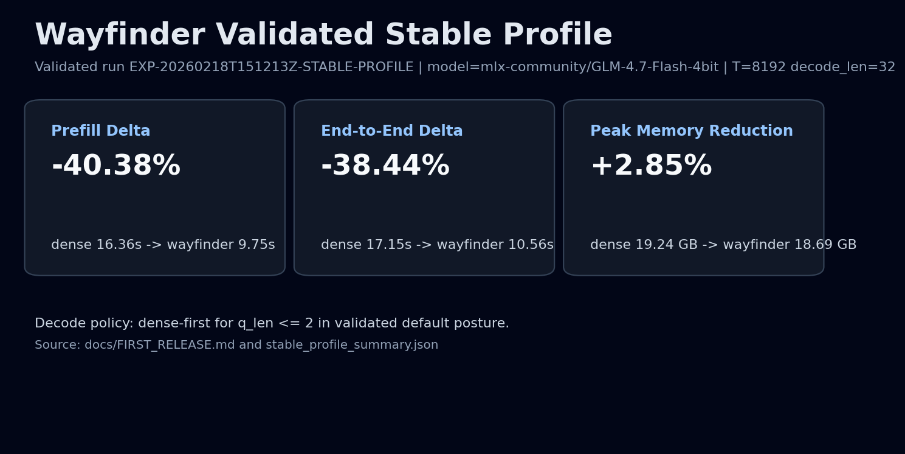

# Visual Storyboard

Use this sequence for public-facing explanations. Each visual has one purpose and one evidence anchor.

## Visual 1: Pattern Landscape (Hero)
- File: `docs/assets/attention_comparison_5panel.png`
- Command:
```bash
python3 scripts/viz/attention_pattern_comparison.py --seq-len 64 --window 8 --out docs/assets/attention_comparison_5panel.png
```
- Purpose: show that Butterfly is a distinct sparse pattern class (`window + cycle + landmarks`) rather than dense attention.
- Claim supported: bounded sparse neighborhood construction.
- Source docs: `README.md`, `docs/ARCHITECTURE.md`.


## Visual 2: Hamiltonian Cycle Mechanism (Explainability)
- File: `docs/assets/hcsa_graph_circle.png`
- Command:
```bash
python3 scripts/viz/graph_viz.py --seq-len 32 --window 4 --landmark-stride 8 --out docs/assets/hcsa_graph_circle.png
```
- Purpose: make cycle edges, local window edges, and landmarks visually separable.
- Claim supported: each token gets cycle neighbors before causal masking; neighborhood stays structured and bounded.
- Source docs: `README.md`, `docs/GLOSSARY.md`.


## Visual 3: Validated Proof Card (Credibility)
- File: `docs/assets/wayfinder_metric_card.png`
- Command:
```bash
python3 scripts/viz/wayfinder_metric_card.py \
  --stable-summary-json benchmarks/mlx/first_release/EXP-20260218T151213Z-STABLE-PROFILE/stable_profile_summary.json \
  --out docs/assets/wayfinder_metric_card.png
```
- Purpose: tie mechanism to measured outcomes on the validated public profile.
- Claim supported: prefill/e2e gains with memory reduction on the validated GLM path.
- Evidence source: `docs/FIRST_RELEASE.md`.



## Visual order
- Visual 1 first in the README.
- Visual 2 after mechanism explanation.
- Visual 3 adjacent to evidence/support matrix.
- Do not pair Visual 3 with claims outside validated scope.
